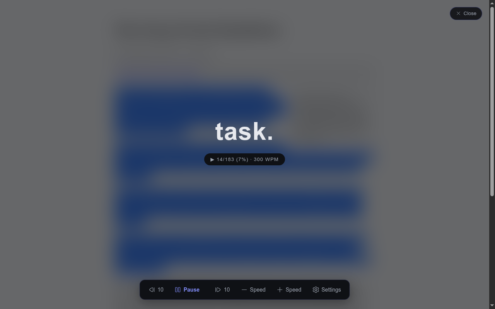
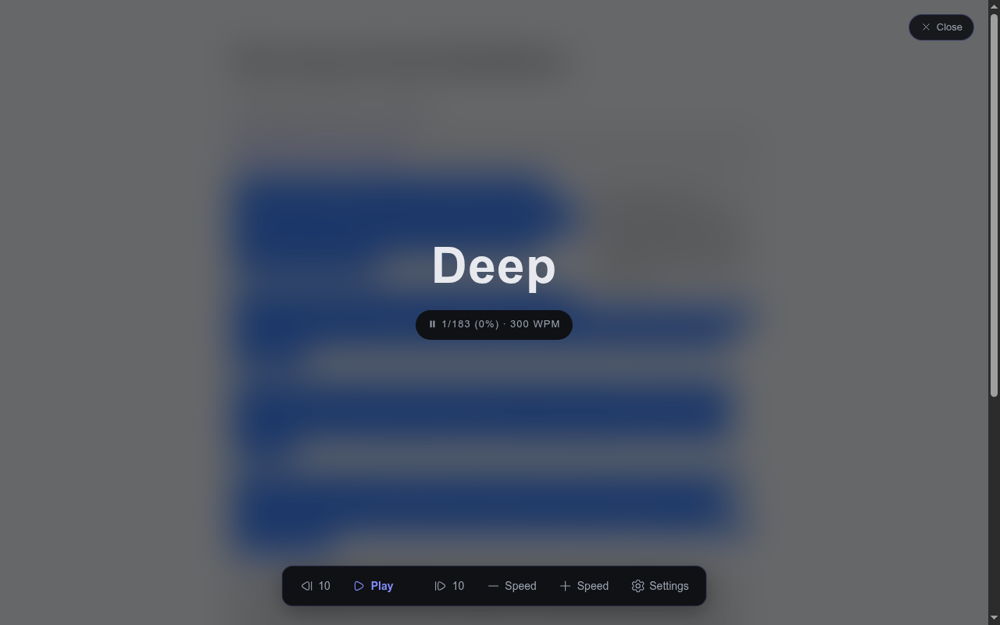
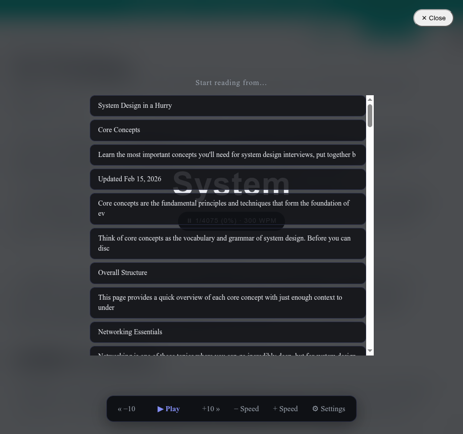
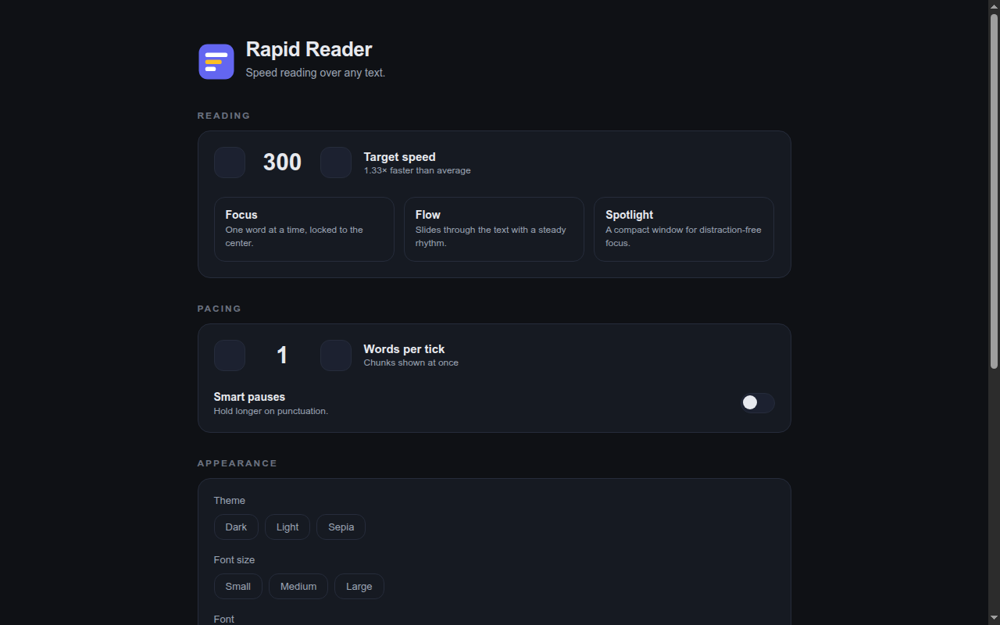

<p align="center">
  
</p>

<h1 align="center">Rapid Reader</h1>

<p align="center">
  <strong>RSVP speed reading for Chrome.</strong> Select any text, press <kbd>Alt</kbd>+<kbd>R</kbd>, and read it 3× faster — one word at a time, at a fixed point on screen, so your eyes never move.
</p>

<p align="center">
  
</p>

## What it does

Rapid Reader is an [RSVP](https://en.wikipedia.org/wiki/Rapid_serial_visual_presentation) (Rapid Serial Visual Presentation) reader: instead of moving your eyes across a line, it flashes each word at a fixed point at your chosen speed. Your eyes stay still, your brain stops subvocalizing at line-start, and articles that took 10 minutes take 3.

- **Two entry modes** — read your current selection immediately, or start the whole article: <kbd>Alt</kbd>+<kbd>R</kbd> (or the toolbar icon) highlights the first word of every paragraph, and clicking one starts there.
- **Per-token timing** — commas, semicolons, colons, dashes and sentence enders get proportionally longer rests; paragraph breaks pause the longest. URLs, numbers and long words are handled explicitly. Multi-word chunks stay up as long as their words would take one at a time, so WPM means the same thing at any chunk size.
- **Read aloud, in step with the words** — optional read-aloud via Chrome's built-in text-to-speech. The voice becomes the clock: the display steps with the spoken word and re-syncs on every voice event, even on voices that report nothing (they're measured, not trusted). No voice installed? The button hides itself.
- **Distraction-free by default** — the overlay lives in a shadow DOM (page CSS can't touch it), with dark / light / sepia themes, three font sizes, and four fonts.
- **Reading stats** — words read, average WPM and time saved vs. a 240 WPM baseline, rolled up per day and kept 90 days.
- **Settings that follow you** — every control saves to `chrome.storage.sync` and propagates live to readers already open. No reloads, no account, no data leaves your device.

### Keyboard shortcuts

| Key | Action |
|-----|--------|
| <kbd>Alt</kbd>+<kbd>R</kbd> | Toggle the reader on the current page |
| <kbd>Space</kbd> | Pause / resume |
| <kbd>←</kbd> / <kbd>→</kbd> | Step one word |
| <kbd>↑</kbd> / <kbd>↓</kbd> | Speed ±25 WPM |
| <kbd>[</kbd> / <kbd>]</kbd> | Skip 10 words |
| <kbd>Esc</kbd> | Close |

## Screenshots

| | |
|---|---|
|  |  |
| Words flash at a fixed point, control bar below | Paused mid-article — speed, progress and position visible |
|  |  |
| Click a paragraph marker to start there | Reading, pacing and appearance settings + stats |

## Install (development)

```bash
npm install
npm run build
```

1. Open `chrome://extensions`
2. Enable **Developer mode** (top right)
3. **Load unpacked** → select the `dist/` directory
4. Open any article page and press <kbd>Alt</kbd>+<kbd>R</kbd>, or click the toolbar icon

> [!NOTE]
> The extension injects on user gesture (via `activeTab`) rather than through a static content script — no host permissions are requested. Local `file://` testing (e.g. `test-pages/article.html`) requires **Allow access to file URLs** in `chrome://extensions` → Rapid Reader → Details → Site access.

## Development

```bash
npm run check   # tsc --noEmit + eslint
npm test        # vitest — 142 tests across tokenizer, pauses, timing, stats, extractor, markers, overlay, settings, tts, messages
npm run build   # icons → content script → background → options page → manifest, into dist/
```

The build runs four Vite passes into `dist/`:

| Step | Source | Output |
|------|--------|--------|
| `scripts/gen-icons.mjs` | — | `dist/icons/*.png` (generated, no binary assets in the repo) |
| content build | `src/content/index.ts` | `dist/content.js` |
| background build | `background.ts` | `dist/background.js` |
| options build | `options.html` + `src/options/` | `dist/options.html`, `dist/options.js` |
| manifest copy | `manifest.json` | `dist/manifest.json` |

`npm run dev:content` rebuilds the content script on change; after a content-script change, reload the extension on `chrome://extensions`.

## Architecture

```
background.ts            service worker — Alt+R / toolbar toggle, gesture-based injection, records sessions
src/content/index.ts     wiring — message handling, selection/article extraction, overlay lifecycle
src/content/extractor.ts non-destructive article + selection extraction: scores prose containers,
                         rejects link-dense menus, widens to reach a headline outside the body wrapper
src/content/overlay.ts   shadow-DOM RSVP overlay (controls, themes, font sizes)
src/content/start-marker.ts  clickable paragraph-start markers, offsets derived from the same walk as the tokenizer
src/rsvp/engine.ts       tokenizer + RSVP timing (per-token delays, 25 wpm steps, sentence starts)
src/rsvp/pauses.ts       punctuation pause multipliers
src/options/             options page UI + reading-stats rollup
src/shared/settings.ts   settings model, defaults, storage sync
src/shared/tts.ts        chrome.tts read-aloud — utterance queue, wpm→rate, charIndex→word mapping
src/shared/icon.ts       renders Hugeicons data as SVG (no framework renderer needed)
src/shared/messages.ts   content ↔ background message contract
```
